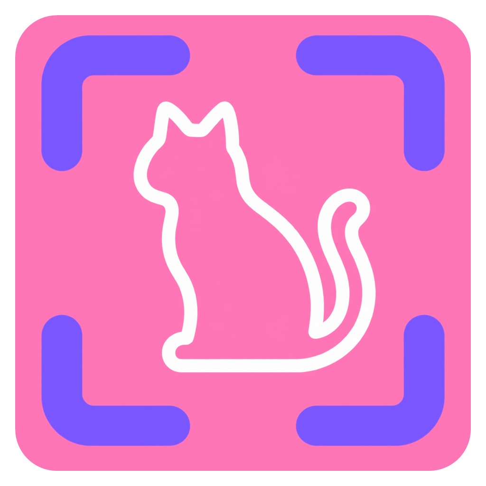
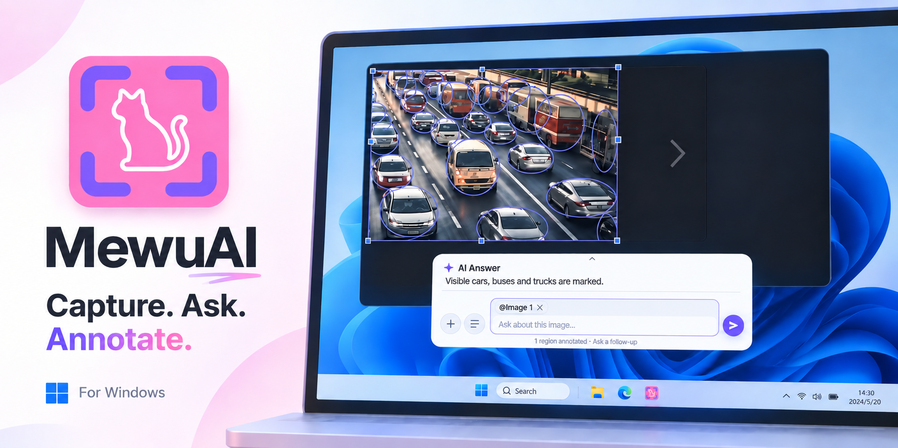
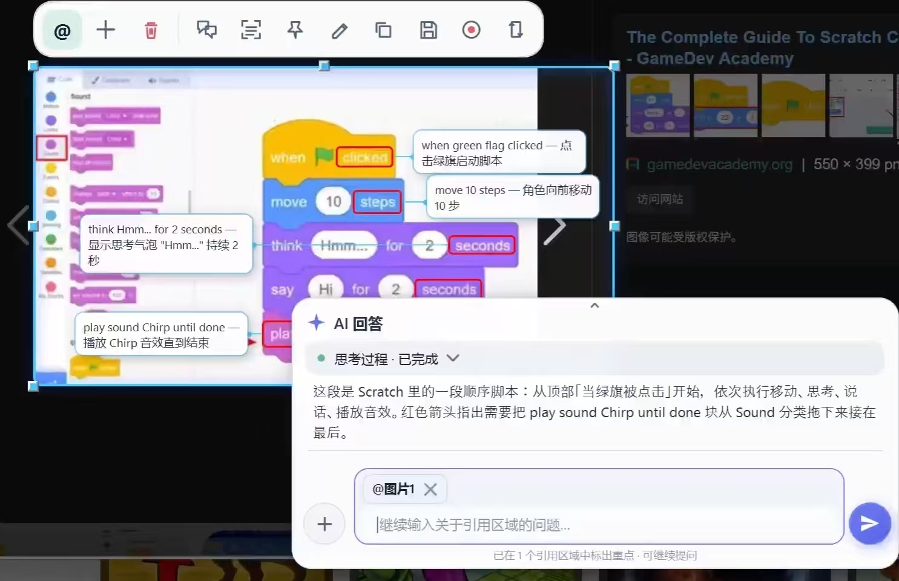
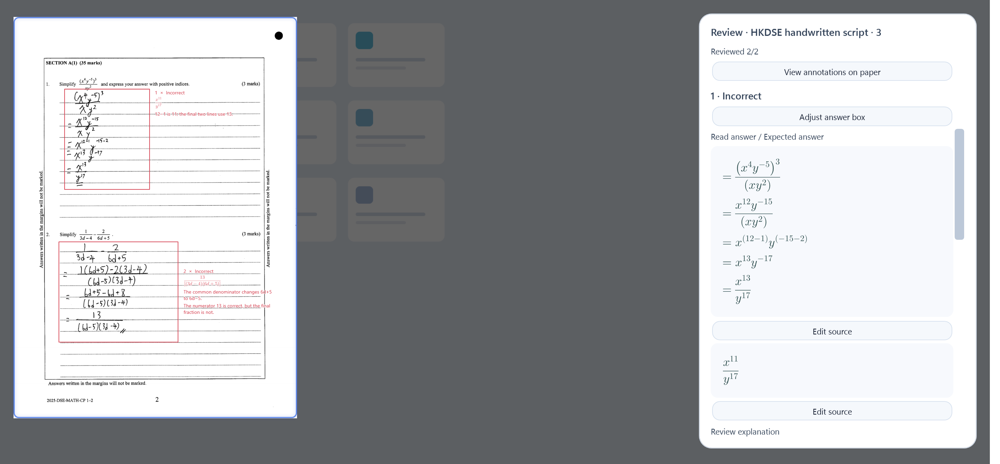
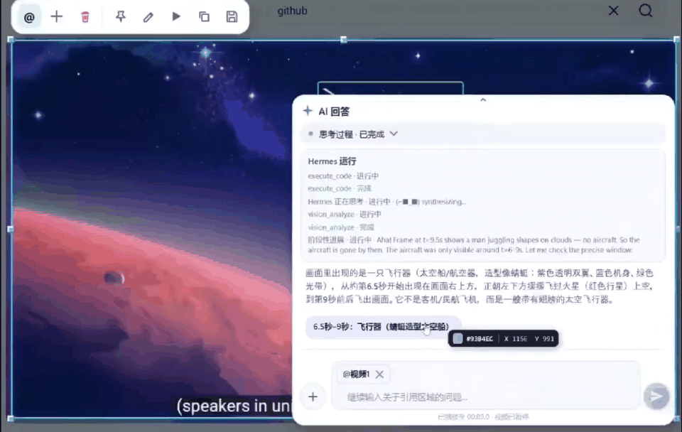
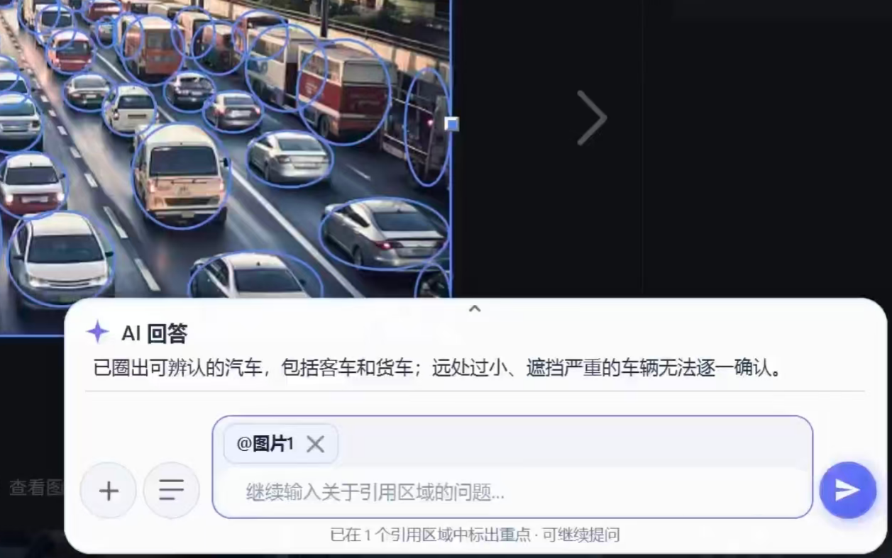
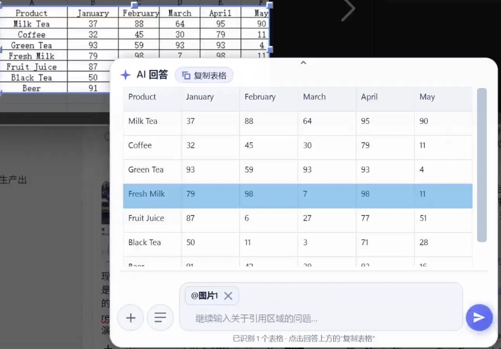

  
  <h1>MewuAI — AI Screenshot Annotation for Windows</h1>
  
Open-source screen capture with in-place AI annotations, offline OCR, screenshot translation, and screen recording.

  

    
    
    
  

  

    <a href="https://github.com/abnste/mewu_ai/releases/download/v0.4.8/MewuAI-Setup-0.4.8-win-x64.exe"><strong>Download installer</strong></a>
    &nbsp;·&nbsp;
    <a href="https://github.com/abnste/mewu_ai/releases/download/v0.4.8/MewuAI-Portable-0.4.8-win-x64.zip">Portable ZIP</a>
  

  
<a href="./README.zh-CN.md">简体中文</a> · <strong>English</strong> · <a href="./CHANGELOG.md">Changelog</a> · <a href="https://github.com/abnste/mewu_ai/issues">Report an issue</a>

**MewuAI (喵呜AI)** is an open-source **AI screenshot annotation tool for Windows**. Select a screen region, reference it in your question, and ask a vision-capable AI model to explain the content or mark important details. Answers, arrows, highlights, and other annotations appear at the original screen positions; you can save the annotated screenshot.

**喵呜AI（MewuAI）是一款 Windows 开源 AI 截图标注软件**，支持 AI 圈选重点、截图问答、离线 OCR、原位翻译、长截图和录屏。中文介绍见[中文首页](./README.zh-CN.md)和[AI 截图标注使用指南](./docs/ai-screenshot-annotation.zh-CN.md)。

| At a glance | Details |
| --- | --- |
| Platform | Windows 10 2004 or later, x64; English and Simplified Chinese |
| Core workflow | Capture → reference a region → ask AI → review and save annotations |
| Works offline | Screenshots, manual markup, pinned images, OCR, and recording |
| AI requirements | A connected account or API; image/video support and charges depend on the selected service |
| Source and downloads | [Official repository](https://github.com/abnste/mewu_ai) · [Latest release](https://github.com/abnste/mewu_ai/releases/latest) |
| License | [MPL-2.0](./LICENSE); third-party terms are listed separately |

Read the [AI screenshot annotation guide](./docs/ai-screenshot-annotation.md) for examples, setup, privacy, and the difference between manual markup, OCR, and AI annotations.

  
   AI-generated concept cover. Actual interface examples are shown below.

## Features

- **Papers and assignments:** Reference exam screenshots in the ordinary conversation bar for explanations and annotations. Reference multiple screenshots to discuss shared problems and generate practice questions; readings and grading still need human review.

- **Screenshots and scrolling capture:** Select a region or window, capture across monitors, and capture long pages without a fixed segment limit. Window-snapped selections offer app snapshots that capture supported scroll areas, restore their position, then pin and reference the result. Availability depends on the application's rendering and scrolling support.
- **Annotations and pinned images:** Add pen strokes, highlights, lines, arrows, shapes, text, numbered markers, and pixelation. Edit selected objects, choose colors from a full-color palette, and preview pixelation while dragging. Hold Shift to constrain lines, arrows and shapes; click Finish to copy the annotated image automatically.
- **Text and tables:** Copy text from images, translate screenshots, and use AI to extract tables for Excel.
- **Screen recording:** Record a region with computer audio and an optional microphone. Export MP4 video, MP3 audio, or a GIF.
- **Ask about images and videos:** Reference several screenshots or attachments, ask follow-up questions, and click a time in an answer to jump to the relevant video scene.
- **Choose your AI:** Connect API services, Hermes, ChatGPT Work / Codex, WorkBuddy, or MiniMax Code. Switch between them and keep your last selection.

Screenshots, manual annotations, pinned images, text recognition, and recording work without an AI account. Translation, table extraction, and AI questions require a connected service.

## Preview

<table>
<tr>
<td width="50%" valign="top">
<h3>Highlight details</h3>

Ask AI to circle items, add checkmarks, or leave notes on a screenshot. Continue with follow-up questions.

</td>
<td width="50%" valign="top">
<h3>Translate screenshots</h3>

Read translations where the original text appears, then select text to copy it.

</td>
</tr>
<tr>
<td width="50%" valign="top">
<h3>Understand code</h3>

Select a piece of code and ask for an explanation tied to the lines you are reading.

</td>
<td width="50%" valign="top">
<h3>Draw and annotate</h3>

Ask AI to add a diagram, or add your own notes with pens, shapes, and text.

</td>
</tr>
<tr>
<td width="50%" valign="top">
<h3>Annotate papers</h3>

Reference exam screenshots for explanations and annotations, or compare several pages to discuss shared errors and create practice.

</td>
<td width="50%" valign="top">
<h3>Analyze videos</h3>

Click a time in an answer to jump to a scene. Annotations follow the subject while a marked segment plays.

</td>
</tr>
<tr>
<td width="50%" valign="top">
<h3>Annotate data</h3>

Ask AI to identify and mark objects in an image, such as visible vehicles in a traffic scene.

</td>
<td width="50%" valign="top">
<h3>Recognize tables</h3>

Turn a table screenshot into a structured answer, then use Copy table to paste it into Excel.

</td>
</tr>
</table>

About the paper demonstration and its source

The paper image is a human-reviewed demonstration from 0.4.2, showing in-place annotations and math typesetting. The current version uses ordinary screenshot conversations, multiple region references and the existing conversation bar, with no separate paper workflow entry. Readings and grading still need human review.

Original: [HKEAA 2025 HKDSE Mathematics Compulsory Part sample script](https://www.hkeaa.edu.hk/DocLibrary/HKDSE/Subject_Information/math/2025-Sample-MATH-CP-Level2-E-A756.pdf#page=3) (PDF page 3, printed page 2). The complete handwritten page is preserved. The screenshot shows a result after a reviewer checked each question and corrected readings and answer boxes. Copyright belongs to the original owner.

## Get started

> **Mac users:** MewuAI does not currently support macOS. Explore our partner project [**kangarooking/Ta**](https://github.com/kangarooking/Ta), an AI screenshot tool for macOS with OCR, translation, scrolling capture, and annotations.

1. **Install and open.** Download the installer above, or extract the portable ZIP and run MewuAI.exe. Requires Windows 10 2004 or later, x64. No separate .NET installation is needed.
2. **Capture a region.** Press <kbd>Shift</kbd> + <kbd>Alt</kbd> + <kbd>S</kbd>, drag to select an area, and use the toolbar to copy, save, annotate, extract text, or record.
3. **Connect AI.** Set up and save a connection in **Settings → AI**. Use the capture toolbar's reference button to add a region to your question. You can also upload attachments or ask a text-only question.

While capturing, right-click or hold and drag on the canvas to click or drag in the application underneath. Hold <kbd>Ctrl</kbd> while right-clicking to pass through a real right-click. Existing captures remain in place when you release.

**Settings → General** lets you change the capture shortcut and switch between English and Simplified Chinese. Press Delete in the shortcut field to disable it. Restart the app after changing its language.

You can maximize Settings with its maximize button or by double-clicking the title bar; repeat to restore the compact window.

## AI connections

| Connection | What you need |
| --- | --- |
| API | Your provider's API key and a model. Search built-in China/global service templates, load their model catalogs, and save multiple independent connections. [Supported services and setup](docs/api-providers.md). |
| Hermes | A configured Hermes installation on your PC. Choose a profile and model in settings. |
| ChatGPT Work / Codex | A signed-in ChatGPT Work / Codex installation on your PC. Choose a model and reasoning level in settings. |
| WorkBuddy | Install and sign in to WorkBuddy desktop, then connect and choose a model in settings. |
| MiniMax Code | Sign in to MiniMax Code desktop. You can open it from settings; no separate command-line installation is required. |

With multiple connections saved, click the **model button after Upload** in the conversation bar to choose one. Your configurations are kept, and the app remembers your last selection.

Image and video support depends on the selected model. MiniMax M3 is available through API or Hermes. Codex and WorkBuddy may need video-processing tools already installed on your PC to inspect videos. Check AI answers and annotations against the original content.

## FAQ

Does it cost anything?

Screenshots, annotations, pinned images, text recognition, and recording are available without an AI account. AI features use the account or API you connect; your provider determines charges and usage limits.

Why are my selections and annotations missing from a screen share?

Teaching mode is on by default. Share your entire screen in your meeting or classroom app. You can turn it off or back on under **Settings → Capture → Teaching mode**; save and start a new capture to apply the change.

This makes selections, annotations, and newly pinned images and videos visible to viewers. You can also use MewuAI's recording and scrolling capture while teaching mode is on. Controls stay outside the capture area; when there is no room, such as a full-screen capture, they are hidden. Press **F8** to stop recording or finish scrolling capture. During the recording countdown, F8 cancels it.

Are screenshots and conversations uploaded automatically?

Screenshots, manual annotations, and text recognition are processed on your PC. When you use AI analysis, translation, or another AI feature, the relevant content is sent to your chosen service. Text-only questions do not automatically include your desktop.

API keys are stored encrypted on your PC. A connected desktop AI app may also use cloud services.

How do I update? What if an older version cannot update?

Opening Settings checks for updates automatically. You can also check manually in **Settings → About**.

If you use v0.2.5 or earlier, download the installer from this page to upgrade manually. See the [changelog](./CHANGELOG.md) for previous versions and their release notes.

The release page shows a SHA-256 digest in each asset's details for verifying the installer and portable ZIP. A separate checksum file is not provided.

Having trouble installing or recording?

The installer is not code-signed yet, so Windows may show an unknown-publisher prompt. Download from this repository's [Releases](https://github.com/abnste/mewu_ai/releases); the asset details include its SHA-256 checksum.

Windows N / KN editions need the Media Feature Pack to record and play video. For other problems, [open an issue](https://github.com/abnste/mewu_ai/issues) with your app version, Windows version, and steps to reproduce it.

## Contributing

Bug reports, suggestions, code, and documentation improvements are welcome. See the [contributing guide](./CONTRIBUTING.md) for development setup and build instructions, the [code of conduct](./CODE_OF_CONDUCT.md) for community guidelines, and the [security policy](./SECURITY.md) for vulnerability reports.

## License

Created by **Abner Stephen** & **Yandi**.

Project-owned source is licensed under [MPL-2.0](./LICENSE). Commercial use is permitted under the license. When distributing covered software, provide the covered source and retain copyright and license notices as required. See [license and source information](./SOURCE.md) and the separate [third-party notices](./THIRD-PARTY-NOTICES.md).
