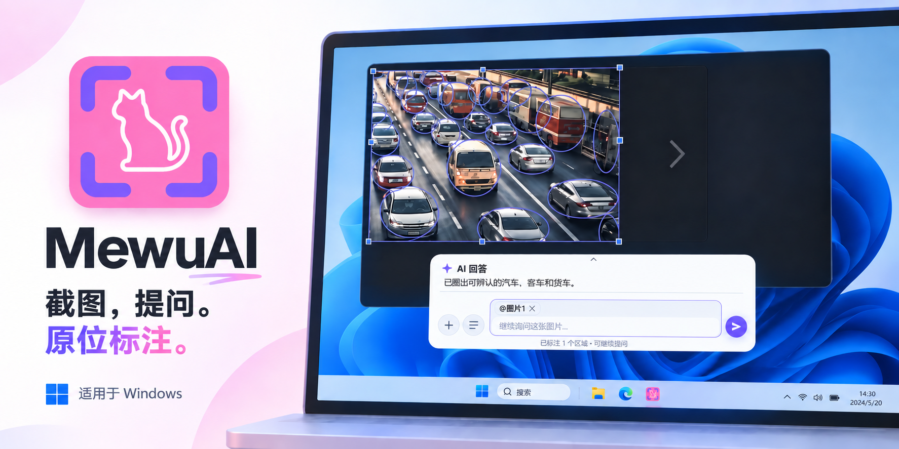
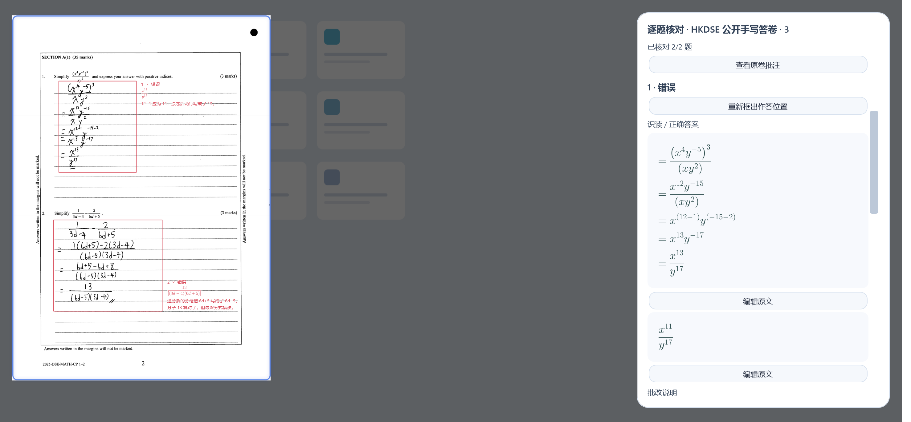

  
  <h1>喵呜AI（MewuAI）— Windows AI 截图标注软件</h1>
  
开源截图工具，支持 AI 原位标注、离线 OCR、截图翻译、长截图和录屏。

  

    
    
    
  

  

    <a href="https://github.com/abnste/mewu_ai/releases/download/v0.4.8/MewuAI-Setup-0.4.8-win-x64.exe"><strong>下载安装版</strong></a>
    &nbsp;·&nbsp;
    <a href="https://github.com/abnste/mewu_ai/releases/download/v0.4.8/MewuAI-Portable-0.4.8-win-x64.zip">免安装版</a>
  

  
<strong>简体中文</strong> · <a href="./README.md">English</a> · <a href="./CHANGELOG.md">更新日志</a> · <a href="https://github.com/abnste/mewu_ai/issues">问题反馈</a>

**喵呜AI（MewuAI）是一款 Windows 开源 AI 截图标注软件**。框选屏幕区域、引用截图并提问后，支持图片理解的 AI 模型可以讲解内容、圈出重点或生成箭头、高亮等标注。回答与标注直接显示在原屏幕位置，核对后可连同截图一起保存。

| 产品速览 | 说明 |
| --- | --- |
| 支持系统 | Windows 10 2004 及以上，x64；简体中文和 English 界面 |
| 核心操作 | 截图 → 引用区域 → 向 AI 提问 → 核对并保存标注 |
| 离线能力 | 截图、手工标注、贴图、OCR 文字识别和录屏 |
| AI 使用条件 | 连接自己的账号或 API；图片/视频能力及费用取决于所选服务 |
| 官方来源 | [GitHub 源码仓库](https://github.com/abnste/mewu_ai) · [最新发行版](https://github.com/abnste/mewu_ai/releases/latest) |
| 开源协议 | [MPL-2.0](./LICENSE)；第三方依赖遵循各自条款 |

想了解“让 AI 在截图上圈出重点”“截图翻译并保留原位置”或“图片文字复制到 Excel”，请看[AI 截图标注使用指南](./docs/ai-screenshot-annotation.zh-CN.md)。

  
   AI 生成的概念封面，实际界面见下方功能演示。

## 功能

- **试卷与作业**：像普通截图一样引用试卷，直接让 AI 讲解、批注；引用多张截图分析共同问题并生成练习，识读与判分仍需人工核对。

- **截图与长截图**：框选区域、选择窗口、多屏截图，长截图不再限制固定拼接次数。自动吸附窗口后可截取应用快照，捕获受支持的滚动区域并恢复原位置，完成后自动置顶和引用；可用性取决于应用的渲染与滚动支持。
- **标注与贴图**：画笔、高亮、直线、箭头、形状、文字、序号和马赛克；选中对象即可调整样式，全彩色板取色，拖动时预览真实马赛克。按住 Shift 约束线条、箭头和形状，点击“完成”后自动复制标注图。
- **文字与表格**：识别并复制图片中的文字，翻译截图；用 AI 提取表格，粘贴到 Excel。
- **录屏与导出**：录制指定区域，支持电脑声音和麦克风；保存为 MP4 视频、MP3 音频或 GIF 动图。
- **看图、看视频提问**：引用多张截图或附件继续追问，查看 AI 批注，点击回答中的时间跳到对应视频片段。
- **选择你常用的 AI**：支持 API、Hermes、ChatGPT Work / Codex、WorkBuddy 和 MiniMax Code，可随时切换，记住上次选择。

截图、手工标注、贴图、文字识别和录屏无需配置 AI。翻译、表格提取及 AI 问答需要连接相应服务。

## 功能演示

<table>
<tr>
<td width="50%" valign="top">
<h3>圈出重点</h3>

让 AI 在截图上圈选、打勾或添加说明，也可以继续追问。

</td>
<td width="50%" valign="top">
<h3>截图翻译</h3>

在原文的位置阅读译文，选中文字即可复制。

</td>
</tr>
<tr>
<td width="50%" valign="top">
<h3>代码讲解</h3>

框选看不懂的代码，让 AI 对着具体位置解释。

</td>
<td width="50%" valign="top">
<h3>绘图与批注</h3>

让 AI 添加图示，或自己用画笔、形状和文字补充说明。

</td>
</tr>
<tr>
<td width="50%" valign="top">
<h3>试卷批注</h3>

引用试卷截图进行讲解和批注；多张截图可一起分析共同问题、生成练习。

</td>
<td width="50%" valign="top">
<h3>视频分析</h3>

点击回答中的时间跳到相关画面；播放标记片段时，批注跟随目标移动。

</td>
</tr>
<tr>
<td width="50%" valign="top">
<h3>数据标注</h3>

让 AI 识别并圈出图片中的目标，例如交通画面里可辨认的车辆。

</td>
<td width="50%" valign="top">
<h3>表格识别</h3>

把截图中的表格识别成行列清晰的回答，点击“复制表格”即可粘贴到 Excel。

</td>
</tr>
</table>

试卷演示与原卷来源

试卷配图为 0.4.2 的真实答卷人工复核演示，用于展示原位批注与数学排版。当前版本统一使用普通截图、多区域引用和原有对话条，没有独立试卷入口。识读与判分仍需人工核对。

原卷：[香港考评局 2025 HKDSE 数学必修部分公开答卷示例](https://www.hkeaa.edu.hk/DocLibrary/HKDSE/Subject_Information/math/2025-Sample-MATH-CP-Level2-E-A756.pdf#page=3)（PDF 第 3 页，卷面页码 2）。截图保留整页真实手写，展示人工逐题核对、修正识读与作答框后的结果。原卷版权归原机构。

## 开始使用

> **Mac 用户：** 喵呜AI 暂不支持 macOS。欢迎了解合作项目 [**kangarooking/Ta**](https://github.com/kangarooking/Ta)（拓），一款支持 macOS 的 AI 截图工具，提供文字识别、翻译、长截图和标注等功能。

1. **安装并打开。** 下载上方安装版，或解压免安装版后运行 MewuAI.exe。支持 Windows 10 2004 及以上的 x64 系统，无需另装 .NET。
2. **截取画面。** 按 <kbd>Shift</kbd> + <kbd>Alt</kbd> + <kbd>S</kbd>，拖动选择区域，再从工具条中选择复制、保存、标注、文字识别或录屏。
3. **连接 AI。** 在 **设置 → AI** 中配置并保存。截图后点击工具条中的引用按钮，把区域加入对话；也可以上传附件或直接输入文字提问。

截图时，在画布上右键点击或按住拖动，可以操作底层应用的左键；按住 <kbd>Ctrl</kbd> 再右键则传递真正的右键操作。松开后恢复截图界面，已有截图继续保留。

在 **设置 → 常规** 中可以修改截图快捷键、切换简体中文或 English。在快捷键输入框按 Delete 可清空快捷键；更换界面语言后重启生效。

设置窗口可点击最大化按钮或双击标题栏放大，再次操作即可还原为紧凑窗口。

## 支持的 AI

| 接入方式 | 如何使用 |
| --- | --- |
| API | 填写服务商的 API Key 并选择模型。可搜索国内外服务商模板、实时加载模型目录，独立保存多个连接。[支持的服务商与接入说明](docs/api-providers.md)。 |
| Hermes | 连接电脑上已经配置好的 Hermes，选择人格和模型。 |
| ChatGPT Work / Codex | 使用电脑上已登录的 ChatGPT Work / Codex，在设置中选择模型和思考程度。 |
| WorkBuddy | 安装并登录 WorkBuddy 桌面版后，在设置中连接并选择模型。 |
| MiniMax Code | 使用 MiniMax Code 桌面版的登录状态；可从设置中打开客户端，无需另装命令行工具。 |

配置好多个服务后，点击对话条中 **上传按钮后面的模型按钮**，直接选择要使用的模型。各项配置会保留，下次打开仍使用上次的选择。

图片和视频支持取决于所选模型。MiniMax M3 可通过 API 或 Hermes 使用；Codex、WorkBuddy 分析视频时可能需要电脑上已有的视频处理工具。AI 回答和标注请结合原内容核对。

## 常见问题

需要付费吗？

截图、标注、贴图、文字识别和录屏可直接使用。AI 功能使用你配置的账号或 API，费用与额度由对应服务商决定。

为什么会议共享里看不到截图和标注？

教学演示模式默认开启，在腾讯会议、极域等软件中共享整个屏幕即可。可在 **设置 → 捕获 → 教学演示模式** 中关闭或重新开启，保存后重新截图生效。

开启后，框选、标注以及新建的贴图、贴视频可被共享，也可以继续使用喵呜AI的录屏和长截图。录制或采集时，控制条会移到选区外；全屏等没有空位的情况会隐藏控制条，按 **F8** 停止录屏或完成长截图，倒计时中按 F8 可取消录屏。

截图和聊天内容会自动上传吗？

截图、手工标注和文字识别在电脑上完成。使用 AI 分析、翻译等功能时，相关内容会发送给你选择的服务；纯文字聊天不会自动附带桌面截图。

API Key 在电脑上加密保存。连接已安装的 AI 客户端也可能使用云端服务，请按自己的需求选择。

如何更新？旧版自动更新失败怎么办？

打开设置会自动检查更新，也可以在 **设置 → 关于** 中手动检查。

使用 v0.2.5 及更早版本时，请从本页下载安装器手动升级。已发布的版本和每次更新内容都可以在[更新日志](./CHANGELOG.md)中查看。

发行页各下载文件的详情中提供 SHA-256 校验值，可用于校验安装器和免安装 ZIP，不再单独附带校验文件。

安装或录屏遇到问题怎么办？

安装包暂未代码签名，Windows 可能提示未知发布者。请从本仓库 [Releases](https://github.com/abnste/mewu_ai/releases) 下载，文件详情中可查看 SHA-256。

Windows N / KN 版本需要安装 Media Feature Pack 才能录制和播放视频。其他问题请在 [Issues](https://github.com/abnste/mewu_ai/issues) 中反馈，附上软件版本、Windows 版本和复现步骤。

## 参与项目

欢迎反馈问题、提出建议、改进代码或文档。开发环境和构建方法见[贡献指南](./CONTRIBUTING.md)，参与讨论请遵守[社区行为准则](./CODE_OF_CONDUCT.md)，安全问题见[安全策略](./SECURITY.md)。

## 开源协议

作者：**Abner Stephen**。

项目自有源码采用 [MPL-2.0](./LICENSE)，允许遵守协议的商业使用。对外分发时，请按协议提供受覆盖的源代码并保留版权和许可声明。详见[许可与源码说明](./SOURCE.md)；第三方依赖另见[第三方声明](./THIRD-PARTY-NOTICES.md)。
